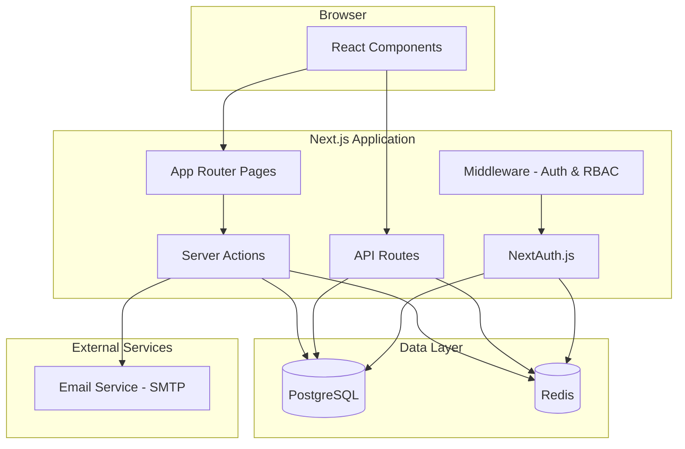
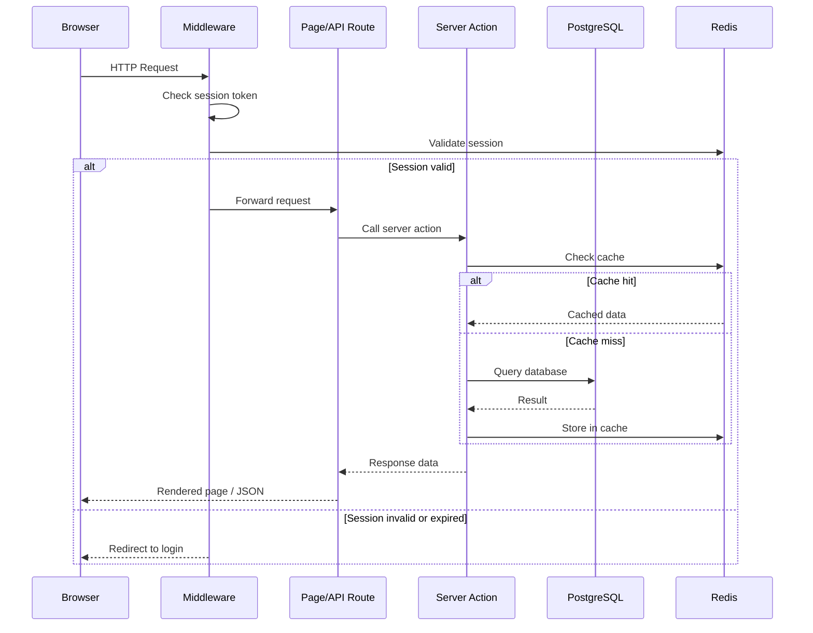
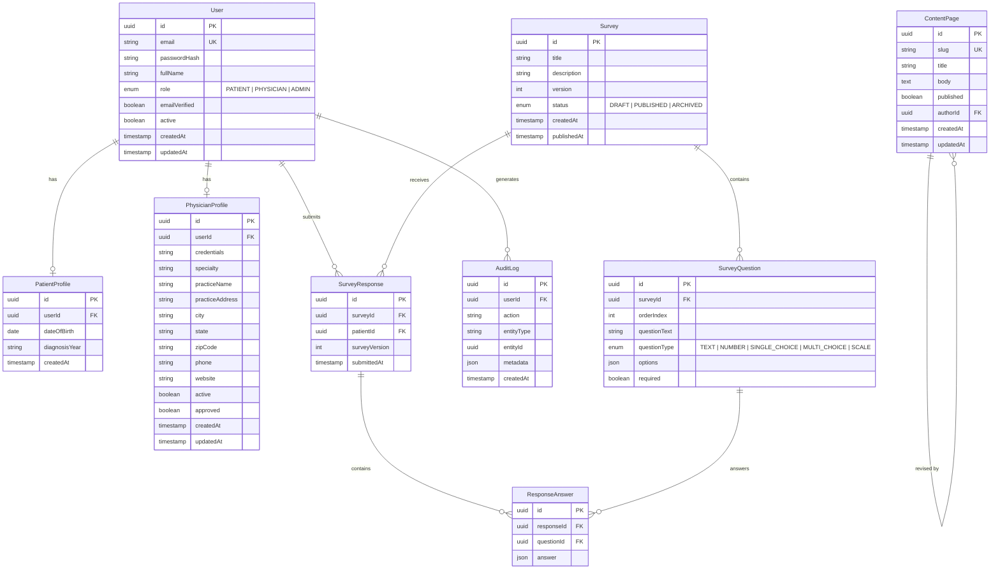

# Design Document: Rare Disease Platform

## Overview

The Rare Disease Platform is a Next.js web application that connects patients and physicians around a specific rare medical condition. It serves three primary functions: building a symptom knowledge base through patient surveys, maintaining a searchable physician registry, and providing educational content about the disease and clinical trials.

The platform uses a role-based architecture with three user types — Patient, Physician, and Administrator — each with distinct capabilities. It is informational only; no payments, transactions, or insurance processing are involved.

### Key Design Decisions

- **Next.js App Router** for server-side rendering, API routes, and file-based routing — provides fast initial page loads (Requirement 10.2) and SEO for public content pages
- **PostgreSQL** as the primary relational database for users, surveys, symptom data, physician profiles, and content
- **Redis** for session management, survey auto-save drafts, and caching of frequently accessed queries
- **Server Actions + API Routes** for data mutations and queries, keeping sensitive logic server-side
- **NextAuth.js** for authentication with credentials provider, email verification, and role-based session tokens
- **Prisma ORM** for type-safe database access and migrations
- **shadcn/ui** for pre-built, accessible UI primitives (buttons, forms, dialogs, cards, tables, etc.) built on Radix UI and Tailwind CSS
- **react-hook-form + zodResolver** for all form handling — consistent pattern across login, registration, surveys, physician profiles, and admin forms using shadcn/ui `Form` components

## Architecture

### High-Level Architecture



### Request Flow



### Folder Structure

```
src/
├── app/
│   ├── (public)/              # Public routes (no auth required)
│   │   ├── page.tsx           # Home page
│   │   ├── about/             # Disease overview, symptoms, diagnosis
│   │   ├── research/          # Research and clinical trials
│   │   ├── find-a-doctor/     # Physician search (public)
│   │   └── auth/
│   │       ├── login/
│   │       ├── register/
│   │       └── verify-email/
│   ├── (patient)/             # Patient-only routes
│   │   ├── surveys/
│   │   │   ├── page.tsx       # Survey list
│   │   │   └── [id]/page.tsx  # Survey form
│   │   └── dashboard/
│   ├── (physician)/           # Physician-only routes
│   │   └── registry/
│   │       └── profile/       # Create/edit registry profile
│   ├── (admin)/               # Admin-only routes
│   │   └── admin/
│   │       ├── dashboard/
│   │       ├── users/
│   │       ├── surveys/
│   │       ├── content/
│   │       └── physicians/
│   ├── api/
│   │   ├── auth/[...nextauth]/
│   │   └── ...
│   └── layout.tsx
├── components/
│   ├── ui/                    # shadcn/ui components (Button, Input, Card, Dialog, Table, etc.)
│   ├── surveys/               # Survey-specific components
│   ├── physician/             # Physician registry components
│   └── admin/                 # Admin panel components
├── lib/
│   ├── auth.ts                # NextAuth config
│   ├── db.ts                  # Prisma client
│   ├── redis.ts               # Redis client
│   ├── cache.ts               # Cache utilities
│   ├── email.ts               # Email service
│   └── validation.ts          # Shared validation schemas (Zod)
├── actions/                   # Server actions
│   ├── auth.ts
│   ├── surveys.ts
│   ├── physicians.ts
│   ├── content.ts
│   └── admin.ts
├── types/                     # TypeScript type definitions
└── middleware.ts               # Auth + RBAC middleware
```

## Components and Interfaces

### Authentication Module

```typescript
// lib/auth.ts — NextAuth configuration
interface AuthConfig {
  providers: [CredentialsProvider];
  session: { strategy: "jwt"; maxAge: number };
  callbacks: {
    jwt: (token, user) => TokenWithRole;
    session: (session, token) => SessionWithRole;
  };
}

interface TokenWithRole {
  id: string;
  role: "PATIENT" | "PHYSICIAN" | "ADMIN";
  emailVerified: boolean;
}
```

```typescript
// actions/auth.ts
async function registerUser(data: RegisterInput): Promise<{ success: boolean; error?: string }>;
async function verifyEmail(token: string): Promise<{ success: boolean; error?: string }>;
async function requestPasswordReset(email: string): Promise<void>;
```

```typescript
// middleware.ts — Route protection
interface RouteConfig {
  publicRoutes: string[];
  patientRoutes: string[];
  physicianRoutes: string[];
  adminRoutes: string[];
}
// Middleware checks JWT role claim against route config
```

### Survey Module

```typescript
// actions/surveys.ts
async function getAvailableSurveys(patientId: string): Promise<Survey[]>;
async function getSurveyById(surveyId: string): Promise<SurveyWithQuestions>;
async function submitSurveyResponse(data: SurveySubmission): Promise<{ success: boolean; errors?: FieldError[] }>;
async function saveSurveyDraft(data: SurveyDraft): Promise<void>;
async function getSurveyDraft(patientId: string, surveyId: string): Promise<SurveyDraft | null>;

interface SurveySubmission {
  surveyId: string;
  patientId: string;
  responses: { questionId: string; answer: string | number | string[] }[];
}

interface SurveyDraft {
  surveyId: string;
  patientId: string;
  responses: Partial<SurveySubmission["responses"]>;
  lastSavedAt: Date;
}
```

### Physician Registry Module

```typescript
// actions/physicians.ts
async function createOrUpdateProfile(data: PhysicianProfileInput): Promise<{ success: boolean; errors?: FieldError[] }>;
async function getPhysicianProfile(physicianId: string): Promise<PhysicianProfile | null>;
async function toggleProfileVisibility(physicianId: string, active: boolean): Promise<void>;
async function searchPhysicians(query: PhysicianSearchQuery): Promise<PaginatedResult<PhysicianProfile>>;

interface PhysicianSearchQuery {
  location?: string;
  name?: string;
  specialty?: string;
  page: number;
  pageSize: number;
}
```

### Content Management Module

```typescript
// actions/content.ts
async function getPublishedContent(slug: string): Promise<ContentPage | null>;
async function listPublishedContent(): Promise<ContentPageSummary[]>;
async function createContent(data: ContentInput): Promise<ContentPage>;
async function updateContent(id: string, data: ContentInput): Promise<ContentPage>;
async function togglePublishStatus(id: string, published: boolean): Promise<void>;
```

### Admin Module

```typescript
// actions/admin.ts
async function listUsers(filters: UserFilters): Promise<PaginatedResult<UserSummary>>;
async function updateUserStatus(userId: string, active: boolean): Promise<void>;
async function updateUserRole(userId: string, role: Role): Promise<void>;
async function getDashboardMetrics(): Promise<DashboardMetrics>;
async function reviewPhysicianProfile(profileId: string, approved: boolean): Promise<void>;

interface DashboardMetrics {
  totalUsers: number;
  totalPatients: number;
  totalPhysicians: number;
  surveyCompletionCount: number;
  activePhysicianProfiles: number;
}
```

### Cache Layer

```typescript
// lib/cache.ts
async function getCached<T>(key: string): Promise<T | null>;
async function setCached<T>(key: string, data: T, ttlSeconds: number): Promise<void>;
async function invalidateCache(pattern: string): Promise<void>;
async function extendSession(sessionId: string): Promise<void>;

// Cache key conventions:
// "session:{sessionId}" — user sessions
// "survey-draft:{patientId}:{surveyId}" — auto-save drafts
// "physician-search:{queryHash}" — search result cache
// "content:{slug}" — published content pages
// "metrics:dashboard" — admin dashboard metrics
```

### Validation Layer

```typescript
// lib/validation.ts — Zod schemas
const registerSchema: z.ZodSchema<RegisterInput>;
const surveyResponseSchema: z.ZodSchema<SurveySubmission>;
const physicianProfileSchema: z.ZodSchema<PhysicianProfileInput>;
const contentPageSchema: z.ZodSchema<ContentInput>;
const physicianSearchSchema: z.ZodSchema<PhysicianSearchQuery>;
```

## Data Models

### Entity Relationship Diagram



### Prisma Schema (Key Models)

```prisma
enum Role {
  PATIENT
  PHYSICIAN
  ADMIN
}

enum SurveyStatus {
  DRAFT
  PUBLISHED
  ARCHIVED
}

enum QuestionType {
  TEXT
  NUMBER
  SINGLE_CHOICE
  MULTI_CHOICE
  SCALE
}

model User {
  id              String            @id @default(uuid())
  email           String            @unique
  passwordHash    String
  fullName        String
  role            Role
  emailVerified   Boolean           @default(false)
  active          Boolean           @default(true)
  createdAt       DateTime          @default(now())
  updatedAt       DateTime          @updatedAt
  patientProfile  PatientProfile?
  physicianProfile PhysicianProfile?
  surveyResponses SurveyResponse[]
  auditLogs       AuditLog[]
  contentPages    ContentPage[]
}

model PhysicianProfile {
  id              String   @id @default(uuid())
  userId          String   @unique
  user            User     @relation(fields: [userId], references: [id])
  credentials     String
  specialty       String
  practiceName    String
  practiceAddress String
  city            String
  state           String
  zipCode         String
  phone           String
  website         String?
  active          Boolean  @default(true)
  approved        Boolean  @default(false)
  createdAt       DateTime @default(now())
  updatedAt       DateTime @updatedAt
}

model Survey {
  id          String         @id @default(uuid())
  title       String
  description String
  version     Int            @default(1)
  status      SurveyStatus   @default(DRAFT)
  createdAt   DateTime       @default(now())
  publishedAt DateTime?
  questions   SurveyQuestion[]
  responses   SurveyResponse[]
}

model SurveyResponse {
  id            String           @id @default(uuid())
  surveyId      String
  survey        Survey           @relation(fields: [surveyId], references: [id])
  patientId     String
  patient       User             @relation(fields: [patientId], references: [id])
  surveyVersion Int
  submittedAt   DateTime         @default(now())
  answers       ResponseAnswer[]
}
```

## Correctness Properties

*A property is a characteristic or behavior that should hold true across all valid executions of a system — essentially, a formal statement about what the system should do. Properties serve as the bridge between human-readable specifications and machine-verifiable correctness guarantees.*

### Property 1: Registration round-trip

*For any* valid registration input (email, password, full name, role), registering the user and then verifying the email token should result in a verified user account that can be retrieved with matching email, full name, and role.

**Validates: Requirements 1.2, 1.3**

### Property 2: Login/logout session lifecycle

*For any* registered and verified user with valid credentials, logging in should create a session in the Session_Store, and subsequently logging out should remove that session so it is no longer valid.

**Validates: Requirements 1.4, 1.7**

### Property 3: Invalid credentials produce generic error

*For any* combination of invalid credentials (wrong email, wrong password, or both), the error message returned by the Auth_System should be identical and should not reveal which specific field was incorrect.

**Validates: Requirements 1.5**

### Property 4: Role-based access control

*For any* user with a given role (Patient, Physician, Admin, or unauthenticated) and any route in the application, the middleware should grant access if and only if the route is permitted for that role — Patients cannot access Physician or Admin routes, Physicians cannot access Patient or Admin routes, unauthenticated users can only access public routes, and only Admins can access Admin routes.

**Validates: Requirements 1.8, 6.2, 7.1**

### Property 5: Survey submission validation

*For any* survey submission, the system should accept it if and only if all required fields are present and valid. Accepted submissions should be stored in the Symptom_Database with matching data, and rejected submissions should identify exactly the set of missing or invalid fields.

**Validates: Requirements 2.3, 2.4**

### Property 6: Survey draft round-trip

*For any* partial survey state saved as a draft (whether manually or via auto-save), retrieving the draft for the same patient and survey should return data equivalent to what was saved.

**Validates: Requirements 2.6, 2.7**

### Property 7: Survey response access control

*For any* patient's survey response, only the submitting patient and authorized administrators should be able to retrieve it. Any other patient requesting the same response should be denied access.

**Validates: Requirements 2.8, 9.3**

### Property 8: Survey storage integrity

*For any* sequence of survey submissions from the same patient, every stored response should contain a timestamp, the patient identifier, and the survey version. Additionally, submitting a new response should never overwrite or remove any previously stored response — the total count of responses should only increase.

**Validates: Requirements 3.1, 3.4**

### Property 9: Aggregated data query filtering

*For any* set of filter criteria (symptom type, severity, frequency, date range) applied to the symptom database, every result returned should match all specified filter criteria, and no matching record should be excluded from the results.

**Validates: Requirements 3.2**

### Property 10: Aggregated statistics de-identification

*For any* aggregated symptom statistics produced for the public-facing page, the output should contain no patient identifiers, emails, names, or any other personally identifiable information.

**Validates: Requirements 3.3**

### Property 11: Physician profile validation

*For any* physician profile submission, the system should accept it if and only if all required fields (name, credentials, specialty, practice location, contact information) are present and valid. Rejected submissions should identify exactly the set of missing or invalid fields.

**Validates: Requirements 4.2, 4.3**

### Property 12: Physician profile update overwrites

*For any* physician with an existing profile, submitting an updated profile should result in the stored profile matching the new submission exactly, with no remnants of the previous data in the updated fields.

**Validates: Requirements 4.4**

### Property 13: Physician search returns matching active profiles

*For any* search query and physician dataset, every result returned should be an active profile that matches the search criteria, and no active matching profile should be excluded from the results. Inactive profiles should never appear in results.

**Validates: Requirements 4.5, 5.2**

### Property 14: Search results contain required information

*For any* physician profile in search results, the rendered result should include the physician's name, credentials, specialty, practice location, and contact information.

**Validates: Requirements 5.3**

### Property 15: Dashboard metrics accuracy

*For any* dataset of users, survey responses, and physician profiles, the dashboard metrics should report counts that exactly match the actual counts in the database (total registered users, survey completion counts, active physician profiles).

**Validates: Requirements 7.6**

### Property 16: Session management lifecycle

*For any* session created with a configurable expiration time, the session should be stored with the correct TTL. After an authenticated request, the session expiration should be extended. An expired session should no longer be valid.

**Validates: Requirements 8.1, 8.2**

### Property 17: Password hashing

*For any* user registration with a plaintext password, the stored password hash should not equal the original plaintext password, and should be a valid bcrypt hash that verifies against the original password.

**Validates: Requirements 9.4**

### Property 18: Account deletion de-identification

*For any* user who requests account deletion, after processing the deletion, the user record should contain no personally identifiable information (name, email), and all associated survey responses should be de-identified — retaining the response data but with no link to the original patient identity.

**Validates: Requirements 9.5**

### Property 19: Audit trail completeness

*For any* authentication event (login, logout, failed login) or administrative action (user status change, content publish, profile approval), a corresponding audit log entry should be created containing the acting user, action type, target entity, and timestamp.

**Validates: Requirements 9.6**

## Error Handling

### Authentication Errors

| Error Scenario | Handling Strategy |
|---|---|
| Invalid credentials | Return generic "Invalid email or password" message (Req 1.5) |
| Duplicate email registration | Return "Email already registered" without revealing account details (Req 1.6) |
| Expired/invalid verification token | Display error with option to resend verification email |
| Expired session | Redirect to login with "Session expired" message (Req 8.3) |

### Validation Errors

| Error Scenario | Handling Strategy |
|---|---|
| Missing required survey fields | Return field-level errors with descriptive messages (Req 2.4) |
| Missing required physician profile fields | Return field-level errors with descriptive messages (Req 4.3) |
| Invalid input format (email, phone, etc.) | Return field-level format validation errors via Zod schemas |

### Data Errors

| Error Scenario | Handling Strategy |
|---|---|
| Database connection failure | Return 503 with "Service temporarily unavailable" message; log error |
| Redis connection failure | Fall through to database queries; log cache miss; degrade gracefully |
| Email service failure | Queue email for retry; allow registration to proceed; log failure |

### Access Control Errors

| Error Scenario | Handling Strategy |
|---|---|
| Unauthenticated access to protected route | Redirect to login page (middleware) |
| Unauthorized role accessing restricted route | Return 403 Forbidden; redirect to appropriate dashboard |
| Accessing another patient's survey data | Return 403 Forbidden; log access attempt to audit trail |

### General Error Handling Patterns

- All server actions return `{ success: boolean; error?: string; errors?: FieldError[] }` for consistent client-side handling
- Unhandled exceptions are caught by Next.js error boundaries and display a generic error page
- All errors are logged with context (user ID, action, timestamp) for debugging
- Sensitive error details (stack traces, SQL errors) are never exposed to the client

## Testing Strategy

### Unit Tests (Example-Based)

Unit tests cover specific scenarios, edge cases, and integration points:

- **Authentication**: Registration form rendering, email verification flow, login/logout redirects, duplicate email handling
- **Surveys**: Survey list rendering, step-by-step form navigation, confirmation message display, auto-save timer behavior
- **Physician Registry**: Profile form rendering, search interface rendering, no-results message display
- **Admin Panel**: Dashboard rendering, destructive action confirmation dialogs, user management CRUD operations
- **Content Pages**: Content rendering, WCAG compliance checks (axe-core), responsive layout at key breakpoints
- **Accessibility**: Keyboard navigation for interactive elements, semantic HTML structure, ARIA attributes

### Property-Based Tests

Property-based tests validate universal correctness properties using [fast-check](https://github.com/dubzzz/fast-check) with a minimum of 100 iterations per property.

Each property test references its design document property:

| Property | Test Description | Tag |
|---|---|---|
| Property 1 | Registration round-trip with random valid inputs | `Feature: rare-disease-platform, Property 1: Registration round-trip` |
| Property 2 | Login/logout session lifecycle with random users | `Feature: rare-disease-platform, Property 2: Login/logout session lifecycle` |
| Property 3 | Invalid credentials always produce identical generic error | `Feature: rare-disease-platform, Property 3: Invalid credentials produce generic error` |
| Property 4 | RBAC enforcement across all role/route combinations | `Feature: rare-disease-platform, Property 4: Role-based access control` |
| Property 5 | Survey submission accepted iff all required fields present | `Feature: rare-disease-platform, Property 5: Survey submission validation` |
| Property 6 | Survey draft save/load round-trip | `Feature: rare-disease-platform, Property 6: Survey draft round-trip` |
| Property 7 | Survey response access denied for non-owning patients | `Feature: rare-disease-platform, Property 7: Survey response access control` |
| Property 8 | Survey storage retains metadata and is append-only | `Feature: rare-disease-platform, Property 8: Survey storage integrity` |
| Property 9 | Aggregated query results match all filter criteria | `Feature: rare-disease-platform, Property 9: Aggregated data query filtering` |
| Property 10 | Aggregated stats contain no PII | `Feature: rare-disease-platform, Property 10: Aggregated statistics de-identification` |
| Property 11 | Physician profile accepted iff all required fields present | `Feature: rare-disease-platform, Property 11: Physician profile validation` |
| Property 12 | Profile update fully overwrites previous data | `Feature: rare-disease-platform, Property 12: Physician profile update overwrites` |
| Property 13 | Search returns only matching active profiles | `Feature: rare-disease-platform, Property 13: Physician search returns matching active profiles` |
| Property 14 | Search results render all required physician fields | `Feature: rare-disease-platform, Property 14: Search results contain required information` |
| Property 15 | Dashboard metrics match actual database counts | `Feature: rare-disease-platform, Property 15: Dashboard metrics accuracy` |
| Property 16 | Session TTL set correctly and extended on request | `Feature: rare-disease-platform, Property 16: Session management lifecycle` |
| Property 17 | Stored password is valid bcrypt hash of original | `Feature: rare-disease-platform, Property 17: Password hashing` |
| Property 18 | Deleted user record and responses contain no PII | `Feature: rare-disease-platform, Property 18: Account deletion de-identification` |
| Property 19 | Auth events and admin actions produce audit log entries | `Feature: rare-disease-platform, Property 19: Audit trail completeness` |

### Integration Tests

Integration tests verify end-to-end flows and external service interactions:

- **Email verification flow**: Register → receive email → click link → account verified
- **Survey completion flow**: Login as patient → select survey → complete → submit → verify in database
- **Physician search caching**: Search → verify cache populated → repeat search → verify cache hit (Req 5.5)
- **Content management flow**: Admin creates content → publishes → verify public access (Req 6.4)
- **Admin CRUD operations**: User management, survey management, physician approval (Req 7.2–7.5)
- **Public page caching**: Request public page → verify cache → request again → verify cache hit (Req 8.4)

### Smoke Tests

- TLS 1.2+ configuration verification (Req 9.1)
- Database encryption at rest verification (Req 9.2)
- Required content section pages exist and are accessible (Req 6.1)

### Test Infrastructure

- **Framework**: Jest + React Testing Library for unit tests, fast-check for property-based tests
- **Database**: Use Prisma with an in-memory SQLite or test PostgreSQL instance for integration tests
- **Redis**: Use ioredis-mock for unit/property tests, real Redis for integration tests
- **Email**: Mock email service for all non-integration tests
- **CI**: Run unit + property tests on every PR; integration tests on merge to main
